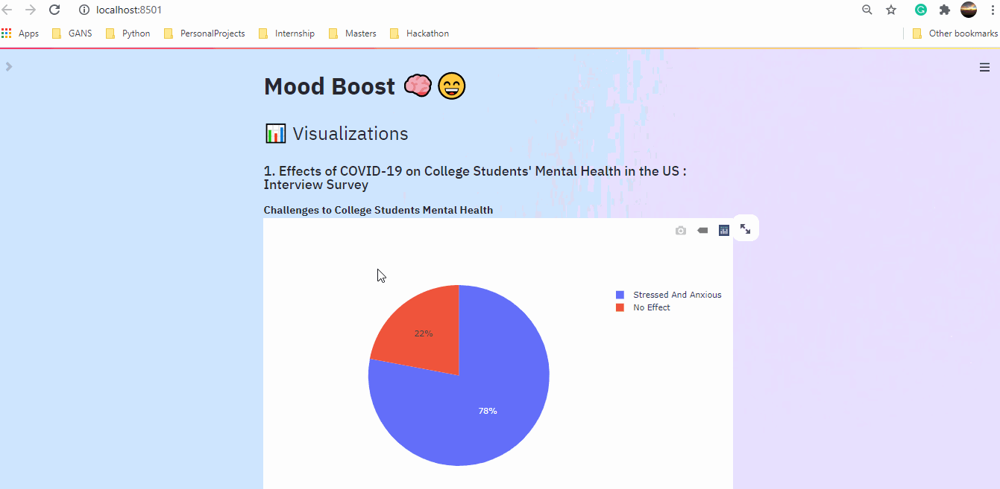

# Mood Boost 🧠😊

**Mood Boost helps users navigate through their lows and celebrate their highs.**

## Inspiration ✨

The year of 2020 will go down in history as one of the worst year for positive mental well-being. More than 43% of people surveyed by the US Census Bureau in December 2020 reported symptoms of anxiety or depression. That is more than 31% of people who reported these symptoms than in the previous year. Mental illness is a leading cause to chronic physical health problems and we want to change this. Our goal is to help individuals improve their mental health during the Covid-19 crisis.

## What it does 🤔

Mood Boost uses voice analysis to detect the users ongoing mood. When a negative mood such as anger is detected, Mood Boost will notify the user and display a positive message as well as lead the user to resources that will boost their mood! When a positive mood such as excitement is detected, Mood Boost will celebrate this positivity with the user.

## How we build it ⚒️

Our application is divided into 2 main parts : 
### Visualizations
Since our primary focus was to identify the effect of COVID-19 on people's mental health and how we could help. We also created visualizations based on research papers and surveys carried out

**[Case study 1: Effects of COVID-19 on College Students' Mental Health in the US : Interview Survey](https://www.jmir.org/2020/9/e21279/)**

Here, we identified that out of the 195 students, 138 (71%) students showed signs of stress and anxiety. In addition to this, we provided a breakdown of the reasons the student feels stress or anxious.

**[Case study 2: ]()**

In this study which was carried out on some students in India, about 831 students believed that during this pandemic they had the opporunity to connect to their parents, relatives, siblings. Where as 351 students had no effect.

**[Case Study 3: Analyzing sucide rates in the US between 2015-2020]()**

### Emotion Classification
- For the video recognition, we made use of [RADVESS Emotion Speech Audio Dataset](https://www.kaggle.com/uwrfkaggler/ravdess-emotional-speech-audio)
- We performed feature extraction from .wav files which included Zero crossing rate, Chroma_stft, MFCC, RMS and MelSpectrogram. This gave us a total of 161 features
- Using these features along with the labels, we trained a CNN model. We plotted the accuracy, losses and confusion matrix.
- We then saved the model weights so that it could be included in the streamlit application.

## Challeneges we ran into 🕵️‍♀️
During the hackathon, we came across several hurdles which included
- Finding the correct data for visualization
- Identifying the correct features to be extracted from the wav files
- Deploying the streamlit application
  
## Accomplishments we are proud of 🏆
- Networking and working with complete strangers
- Creating meaningful visualizations
- Completing training and actually using the model in a streamlit web application

## What we learned 💡
- We learned how to preprocess and create machine learning / deep learning models using audio files.
- We also learned how to use python's Plotly which helped creating interactive plots.

## What’s next for Mood Boost 

In the long term, Mood Boost will be in the form of a bracelet which will send vibrations to notify the user when a negative mood is detected as well as display positive messages. It will also be able to track ongoing mood changes so users can view the fluctuations in their mood.

## Contributors 👨‍💻
- [Mandy Yip](https://github.com/mandyckyip)
- [Utkarsh Mishra](https://github.com/utkarsh0702/)
- [Elita Menezes](https://github.com/ELITA04)
- [Deepa Shree C V](https://github.com/Deepa17)
